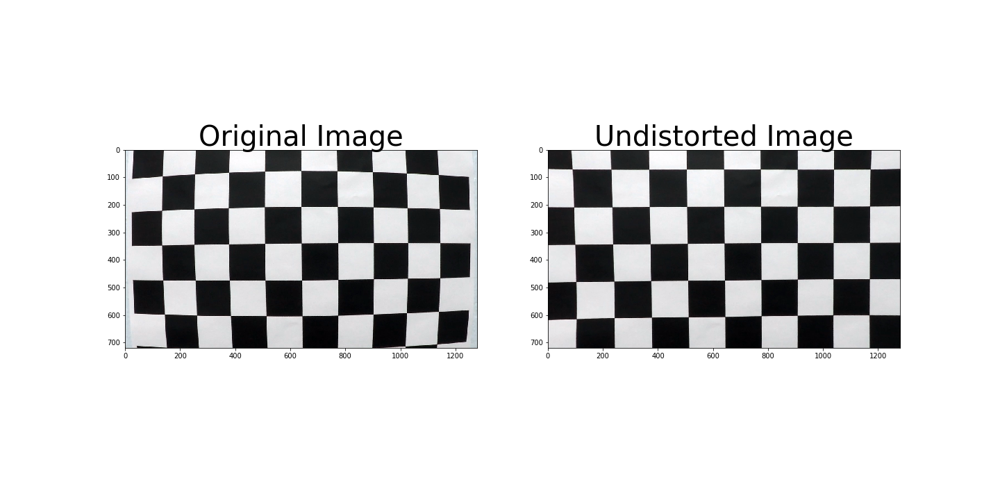
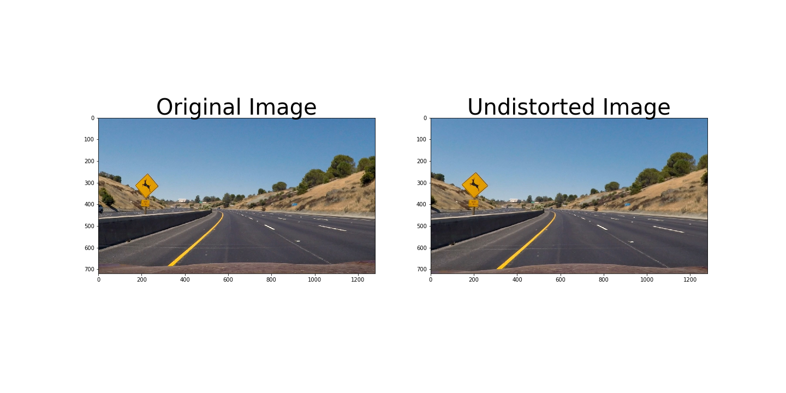
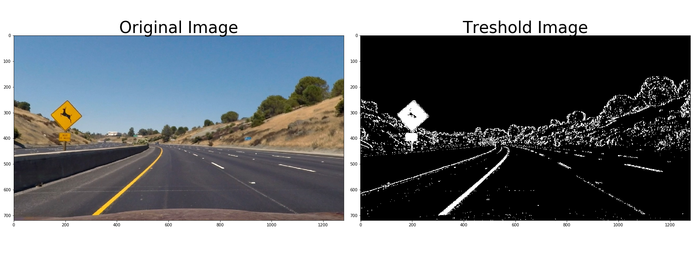
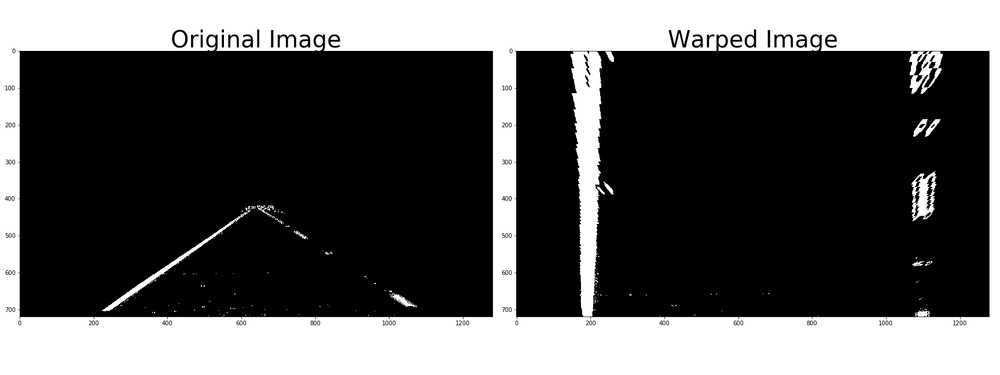
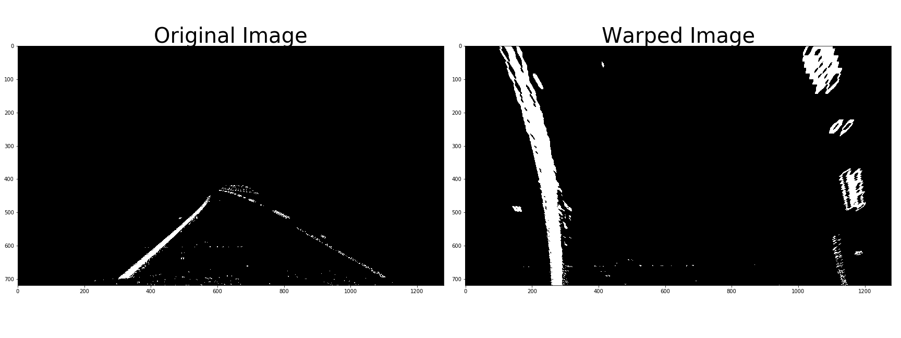
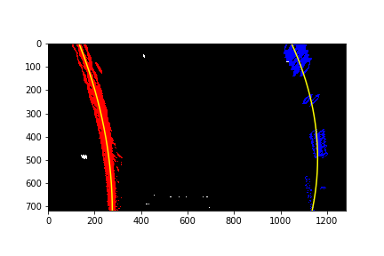
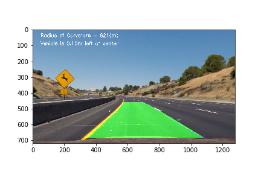

## Writeup Template

---

**Advanced Lane Finding Project**

The goals / steps of this project are the following:

* Compute the camera calibration matrix and distortion coefficients given a set of chessboard images.
* Apply a distortion correction to raw images.
* Use color transforms, gradients, etc., to create a thresholded binary image.
* Apply a perspective transform to rectify binary image ("birds-eye view").
* Detect lane pixels and fit to find the lane boundary.
* Determine the curvature of the lane and vehicle position with respect to center.
* Warp the detected lane boundaries back onto the original image.
* Output visual display of the lane boundaries and numerical estimation of lane curvature and vehicle position.

## [Rubric Points](https://review.udacity.com/#!/rubrics/571/view)

### Here I will consider the rubric points individually and describe how I addressed each point in my implementation.  

---

### Writeup / README

### Camera Calibration

#### 1. Briefly state how you computed the camera matrix and distortion coefficients. Provide an example of a distortion corrected calibration image.

The code for this step is contained in the first code cell of the IPython notebook located in "P4.ipynb"

I start by preparing "object points", which will be the (x, y, z) coordinates of the chessboard corners in the world. Here I am assuming the chessboard is fixed on the (x, y) plane at z=0, such that the object points are the same for each calibration image.  Thus, `objp` is just a replicated array of coordinates, and `objpoints` will be appended with a copy of it every time I successfully detect all chessboard corners in a test image.  `imgpoints` will be appended with the (x, y) pixel position of each of the corners in the image plane with each successful chessboard detection.  

I then used the output `objpoints` and `imgpoints` to compute the camera calibration and distortion coefficients using the `cv2.calibrateCamera()` function.  I applied this distortion correction to the test image using the `cv2.undistort()` function and obtained this result: 

### Pipeline (single images)

#### 1. Provide an example of a distortion-corrected image.

To demonstrate this step, I will describe how I apply the distortion correction to one of the test images like this one:

Using cv2.undistort() function with camera matrix and distant co-efficient calculated in the camera calibration part above

#### 2. Describe how (and identify where in your code) you used color transforms, gradients or other methods to create a thresholded binary image.  Provide an example of a binary image result.

I used a combination of color and gradient thresholds to generate a binary image (thresholding steps are in the function treshold_image() of the 5th code cell in `P4.ipynb`).  Here's an example of my output for this step.  (note: this is not actually from one of the test images)

#### 3. Describe how (and identify where in your code) you performed a perspective transform and provide an example of a transformed image.

The code for my perspective transform includes a function called `warp_image()`, which appears in the 5th cell (as function) and the 8th cell as caller.  The `warp_image()` function takes as inputs an image (`img`), as well as source (`src`) and destination (`dst`) points.  
I choose the source and destination points by finding for points of the lanes in straight line image and then warp it into a square destination. I chose the hardcode the source and destination points in the following manner:

| Source        | Destination   | 
|:-------------:|:-------------:| 
| 264, 686      | 200, 720        | 
| 580, 462      | 200, 0      |
| 700, 462     | 1080, 0      |
| 1034, 686      | 1080, 720        |

I verified that my perspective transform was working as expected by drawing the `src` and `dst` points onto a test image and its warped counterpart to verify that the lines appear parallel in the warped image.

#### 4. Describe how (and identify where in your code) you identified lane-line pixels and fit their positions with a polynomial?

My code to identify lane line pixel is in thefunction search_and_fit_lane_lines() in the 5th code cell.

i) First take a histogram along all the columns in the lower half of the image like this:
 
ii)  I add up the pixel values along each column in the image. In my thresholded binary image, pixels are either 0 or 1, so the two most prominent peaks in this histogram will be good indicators of the x-position of the base of the lane lines. I use that as a starting point for where to search for the lines. From that point, I use a sliding window, placed around the line centers, to find and follow the lines up to the top of the frame.

iii) I fit second order polynomial using np.polyfit()on the nonezeros left and right lanes.

#### 5. Describe how (and identify where in your code) you calculated the radius of curvature of the lane and the position of the vehicle with respect to center.

For the radius of curvature I follow the instruction and sample code given in the lecture. This is done in function find_curvatures() in the 5th code cell. The formula of the derivation is given in the lecture and the sample code I just follow them.

#### 6. Provide an example image of your result plotted back down onto the road such that the lane area is identified clearly.

I implemented this step inin the 12th & 13th code cells.  Here is an example of my result on a test image:

---

### Pipeline (video)

#### 1. Provide a link to your final video output.  Your pipeline should perform reasonably well on the entire project video (wobbly lines are ok but no catastrophic failures that would cause the car to drive off the road!).

Here's a [link to my video result](./project_output.mp4)

---

### Discussion

#### 1. Briefly discuss any problems / issues you faced in your implementation of this project.  Where will your pipeline likely fail?  What could you do to make it more robust?

Yes my pipeline will likely fail in various scenarios, some of them are:
1) The road surface is light in color, making the lane lines not so discernable either in color difference or gradient difference. This will make the color & gradient tresholding not able to pick up the lane line properly.
2) The road corners sharply. This will make my region of interest mask to mask at least one of the lane line altogether, thus breaking my pipeline.
3) The road climbs up or down sharply. We are assuming the road is pretty flat in our warp transform and then the calculation of the curvature - there is no z component to it.

Some things we can do to make it more robust:
1) Instead of a fixed region of interest mask, we can use an image segmentation deep neural network to identify road area, this will take into account any sharp corners.
2) Add z component to the way we warp and calculate curvature, might need to do warp side level, this way we can take into account any steep road climb uphill or downhill.
3) I haven't been taking into account of anomaly in the lane line detection, I should be falling back to last curvature calculation and lane line drawing when anomaly is detected in current frame. If I have more time I will do this.
